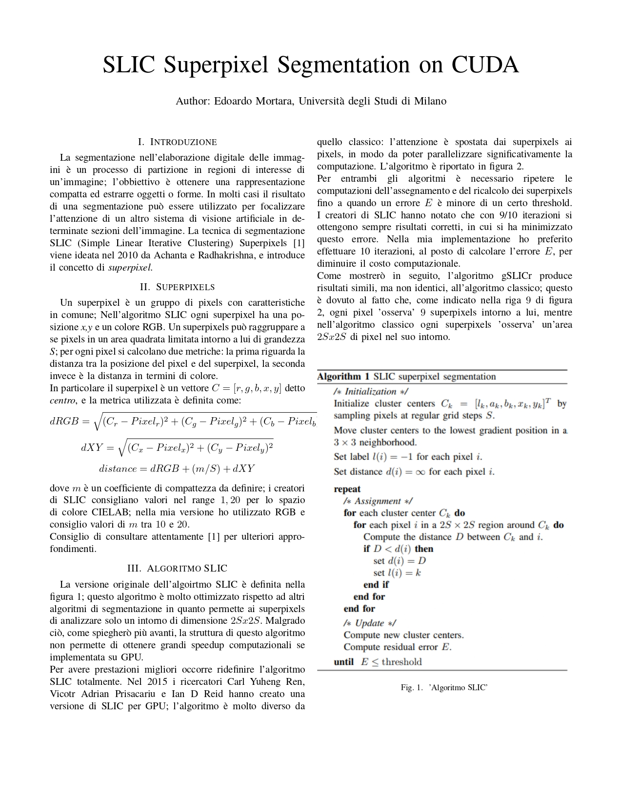
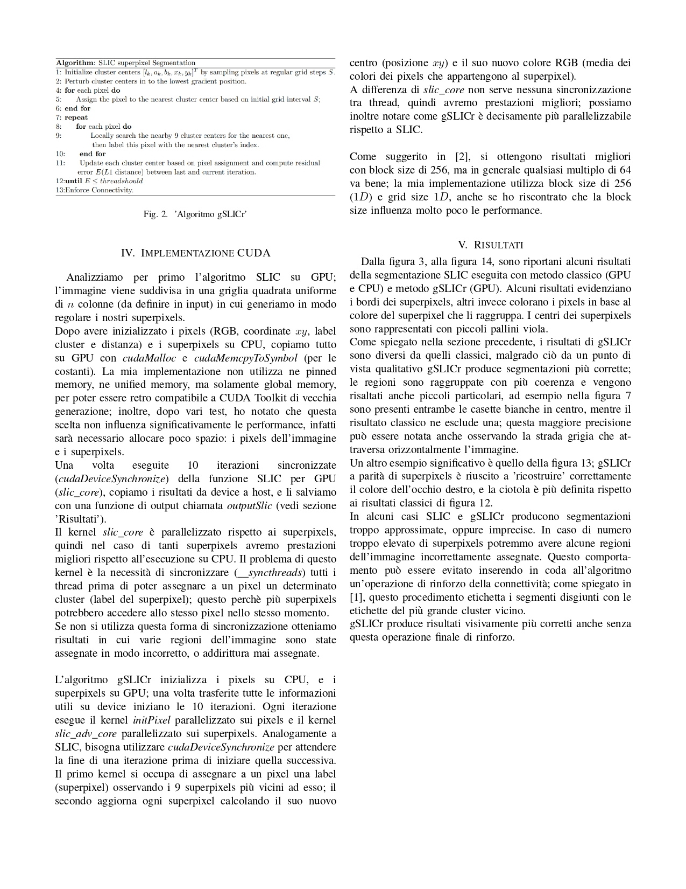
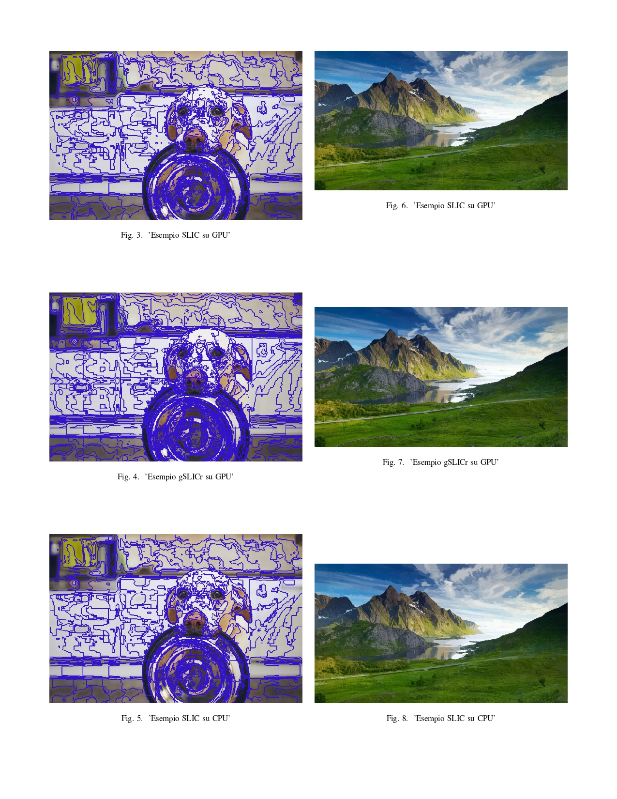
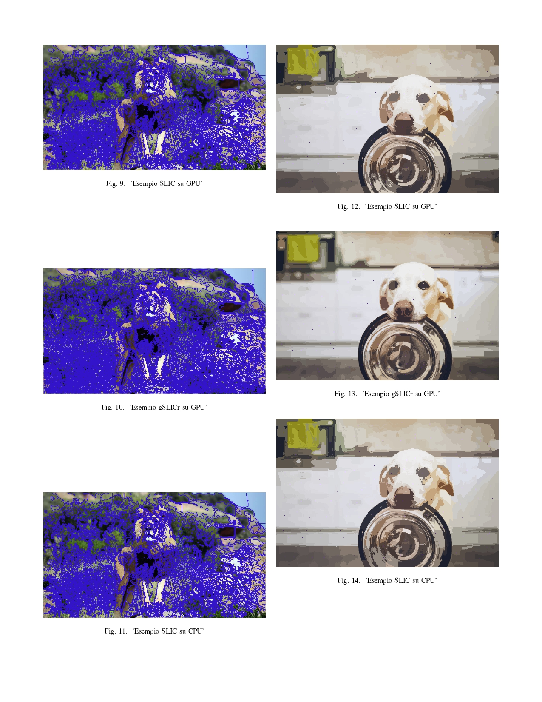
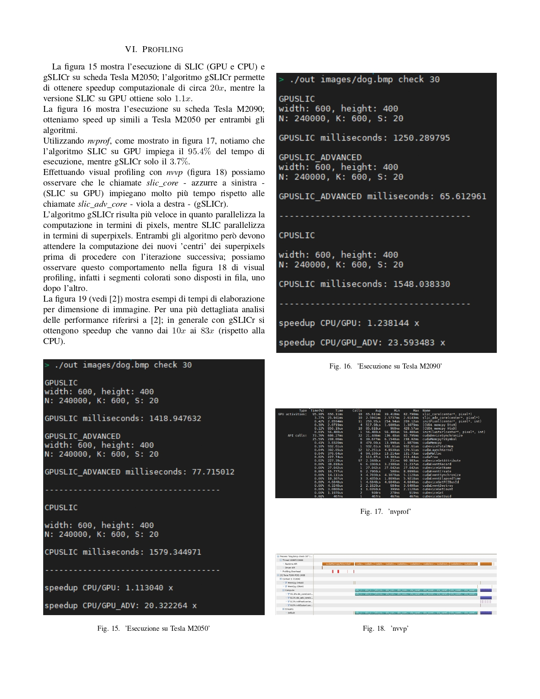
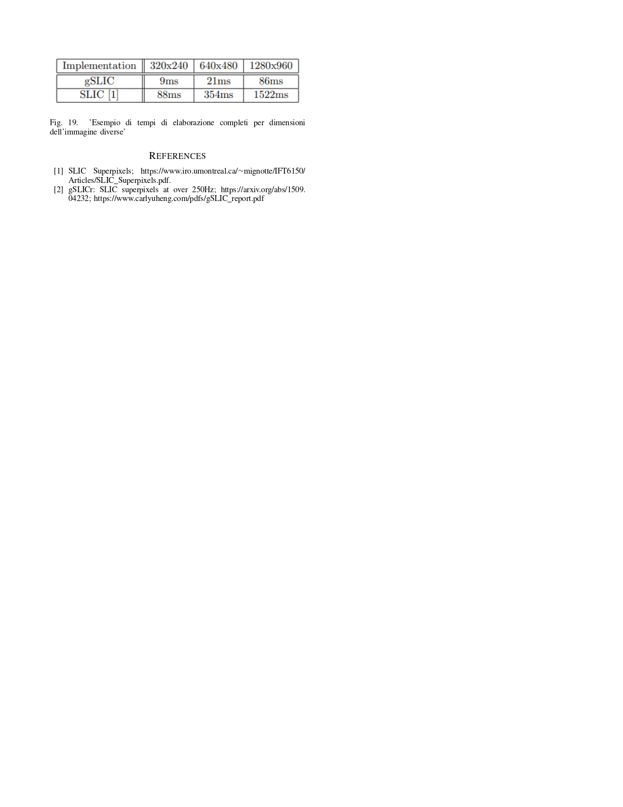

# SLIC Superpixel Segmentation on CUDA

## Author: Edoardo Mortara, Universit`a degli Studi di Milano

## Introduction

Segmentation in digital image processing is a process of partitioning into regions of interest of
an image; the goal is to obtain a representation that is
compact and extract objects or shapes. In many cases the result
of segmentation can be used to focus
the attention of another machine vision system to certain sections of the image. The segmentation technique
SLIC (Simple Linear Iterative Clustering) Superpixels [1]
is devised in 2010 by Achanta and Radhakrishna, and introduces
the concept of superpixels.

## Results

From Figure 3, to Figure 14, are shown some results
of SLIC segmentation performed by classical method (GPU
and CPU) and gSLICr method (GPU). Some results highlight
the edges of the superpixels, while others color the pixels according to the
color of the superpixel that groups them together. The centers of the superpixels
are represented with small purple dots.

In some cases, SLIC and gSLICr produce segmentations that are either
too approximate, or inaccurate. In the case of a number
too large number of superpixels we may have some regions
of the image incorrectly assigned. This behavior can be avoided by inserting at the end of the algorithm
a connectivity reinforcement operation; as explained in
[1], this procedure labels disjoint segments with the
labels of the largest neighboring cluster.
gSLICr produces more visually correct results even without
this final reinforcement operation.

## Profiling

Figure 15 shows the execution of SLIC (GPU and CPU) and
gSLICr on Tesla M2050 board; the gSLICr algorithm allows
to achieve computational speedup of about 20x, while the
SLIC version on GPU achieves only 1.1x.
Figure 16 shows the execution on Tesla M2090 board;
we obtain similar speedups to Tesla M2050 for both
algorithms.

Using nvprof, as shown in figure 17, we note that
the SLIC algorithm on GPU takes 95.4 percent of the time to
execution, while gSLICr only 3.7%.
By performing visual profiling with nvvp (figure 18) we can
observe that the slic core calls - light blue on the left -
(SLIC on GPU) take much longer than the
slic adv core calls - purple on the right - (gSLICr).
The gSLICr algorithm is faster because it parallelizes the
computation in terms of pixels, while SLIC parallelizes
in terms of superpixels. Both algorithms, however, must
wait for the computation of the new 'centers' of the superpixels
before proceeding with the next iteration; we can
observe this behavior in Figure 18 of visual
profiling, in fact the colored segments are arranged in a row, one
after each other.

Figure 19 (see [2]) shows examples of processing times
by image dimension. For a more detailed analysis
of the performance refer to [2]; in general, with gSLICr we get
speedups ranging from 10x to 83x (with respect to the
CPU)

